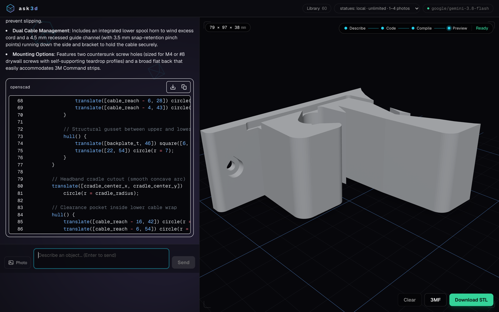
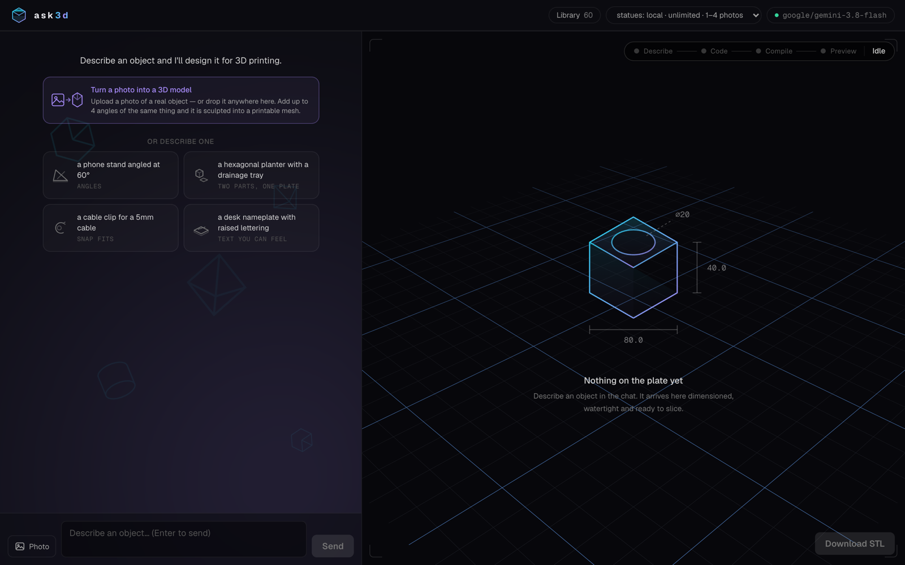
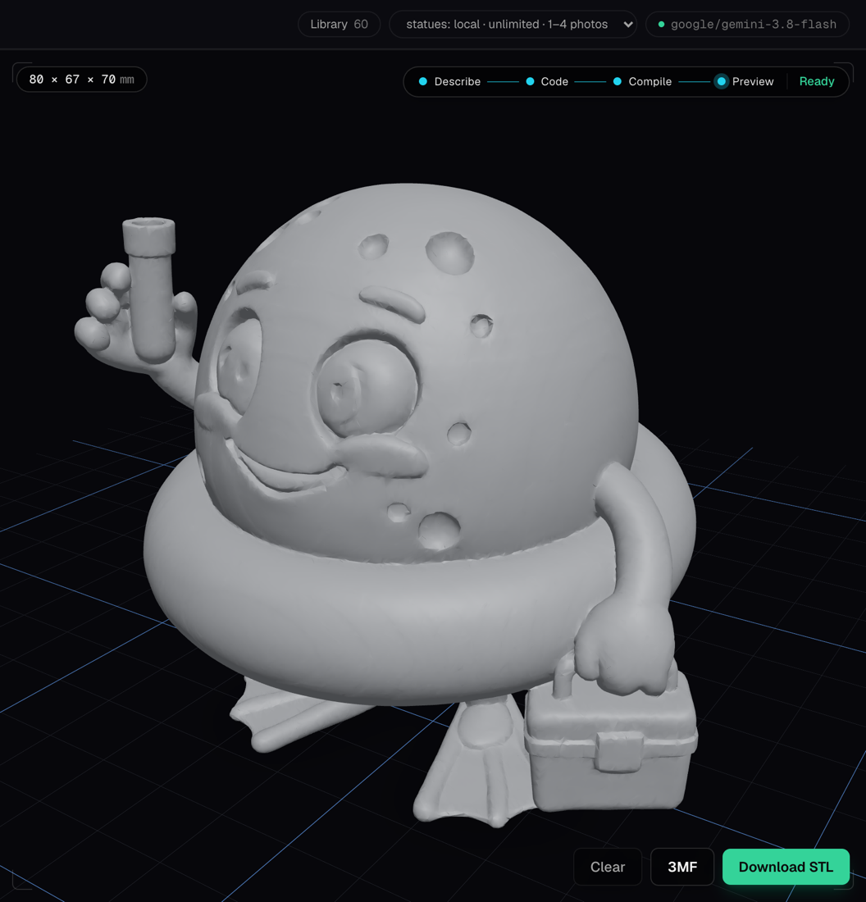
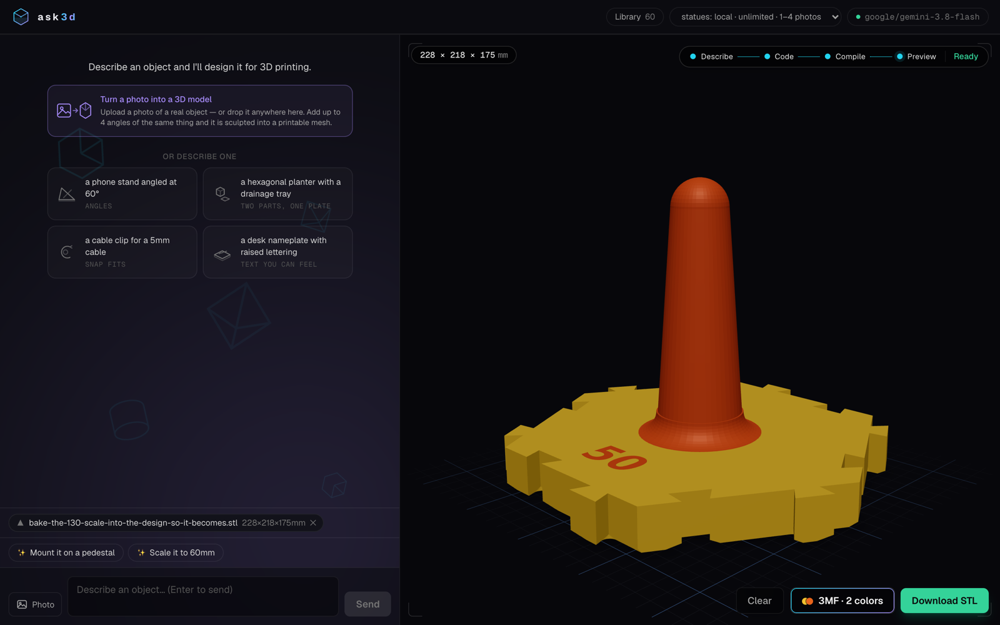

<p align="center">
  
</p>

<p align="center">
  
  
  
  
  
  
</p>

<p align="center">
  <b>Describe an object in a chat box. Get something you can actually print.</b>
</p>

An LLM writes OpenSCAD, your browser compiles it to a mesh with OpenSCAD's
WebAssembly build, a three.js pane shows a print-style preview, and you download
an STL or a Bambu-ready 3MF. Refine by talking — *"make the hole bigger"*,
*"split it onto two plates"*. Compile errors never reach you: the compiler's own
`stderr` goes back to the model and the program is fixed automatically.

<p align="center">
  
</p>

Everything runs locally except the LLM call. No account, no render farm, no
upload step — the compiler is a 10 MB WebAssembly module in your own tab.

## Quickstart

```bash
npm install
./start.sh     # opens http://localhost:3000
```

That is the whole setup. On first run the app asks for an API key in the
interface and writes `.env.local` for you — no dotfile to find, no restart.
Google Gemini is the default and its free tier needs no credit card; OpenRouter
and Anthropic are one click away in the same dialog, and the badge in the header
reopens it whenever you want to switch.

```bash
./start.sh                  # app + statue sidecar, also served on your LAN
./start.sh --local          # loopback only
./start.sh stop             # also kills any running generator (status, logs)
WEB_PORT=3005 ./start.sh    # if something already owns :3000
npm test                    # unit tests
```

Requires Node >= 22. Prefer configuring by hand? Copy `.env.local.example` to
`.env.local` and fill in one key instead.

<p align="center">
  
</p>

> [!WARNING]
> **There is no login.** Anyone who can reach the server can spend your API key,
> so `--local` is the right choice on shared Wi-Fi. Either way `proxy.ts` rejects
> browser requests that did not originate from the app's own page (cross-site
> POSTs, DNS rebinding), and the statue sidecar is only reachable through the
> app's own origin at `/statue/*`.

## How it works

```
 describe ──▶ code ──▶ compile ──▶ preview
     ▲                    │
     └──── auto-repair ◀──┘   compiler output goes back to the model, max 2 rounds
```

| Piece | What it does |
|---|---|
| `components/app-shell.tsx` | The state machine: chat → extract → lint → compile → preview → repair |
| `workers/openscad-worker.ts` | Runs the compiler off the main thread; fresh instance per render, 60 s cap |
| `lib/scad/` | Fence extraction, pre-compile lint, stderr parsing, connected-component checks |
| `lib/threemf.ts` | Hand-rolled 3MF writer (the wasm build's own is broken) |
| `lib/ai/` | Provider registry and the system prompt |
| `statue-service/` | Optional Python sidecar that turns photos into meshes |

Three decisions worth the detour:

- **The model never sees a compiler.** It emits a complete program every turn.
  The app lints it before spending a wasm run and feeds real `stderr` back on
  failure. First-attempt success is roughly half; one feedback round buys more
  than a bigger model does.
- **Geometry is checked, not trusted.** A program can compile perfectly and
  still be unprintable, so every mesh gets a connected-component pass that
  catches fragments severed into mid-air — while parts resting on the build
  plate are left alone, because those are deliberate.
- **Watertightness is non-negotiable.** OpenSCAD's Manifold backend silently
  drops open meshes from any boolean, so an unrepaired import makes a model
  vanish while the compile still reports success.

## Features

🧩 **Uploads** — attach an `.stl` to build around (written into the compiler's
virtual filesystem and referenced with `import()`), a photo to become a
`surface()` heightmap for reliefs and lithophanes, or a `.scad` file to edit.
The lint only permits `import()`/`surface()` of files you actually uploaded.

🗿 **Statues** *(optional, extra install)* — photos of a real object become real
meshes through a local Hunyuan3D-2.1 MLX port: unlimited, a few minutes each on
Apple silicon, no API. Attach two to four angles of the same object and the
extra views are concatenated into the conditioning, which fixes the body mass a
single front photo forces the model to invent. Output is repaired to a
watertight, upright, print-oriented mesh before it reaches the viewer.

One command turns it on — `./statue-service/setup.sh`, about a minute, any
machine — which gets you the cloud engines on a free Hugging Face account. Add
`--local-engine` on Apple silicon for unlimited on-device generation; that is
the part with ~15 GB of weights, which is why it is opt-in rather than cloned.
See [`statue-service/README.md`](statue-service/README.md).

<p align="center">
  
</p>

🎨 **Multi-colour** — ask for colours and the model structures the program into
per-colour modules. The app re-renders each group in the background, tints the
preview, and exports a 3MF of one object with a part per colour, which a Bambu
AMS maps straight onto filament slots.

<p align="center">
  
</p>

📚 **Library** — photos, statues and compiled models are kept server-side with
the prompt that produced them, so every browser pointed at the instance —
desktop, phone, tablet — sees the same shelf.

## OpenSCAD binaries

`public/openscad/` holds the **unmodified** official OpenSCAD WebAssembly
snapshot from <https://files.openscad.org/snapshots/>, loaded at runtime by our
own worker. OpenSCAD is GPL-2.0-or-later — see `public/openscad/NOTICE.txt`.
Nightly snapshots carry no semver guarantee; pin a new zip deliberately and
re-test.

## Known limits

- No `include`/`use` — the wasm build ships no libraries, so BOSL2 and friends
  are out. `text()` works (DejaVu is installed into the virtual filesystem).
- Heavy models hit a 60 s compile cap; the error panel offers a 5-minute retry.
- Attached photos ride only on the most recent message that has files, and are
  downscaled to 512 px.
- Designs target a Bambu Lab A1 (256 mm bed). The prompt defaults to a 175 mm
  footprint so a brim and a multi-colour purge tower still fit.
- Exported 3MFs carry per-object print settings, but Bambu Studio only reads
  them via **File → Open** as a project; dragging the file in discards them and
  keeps the geometry.
- Single-photo statues invent the side they cannot see. Eye-level shots on a
  plain background work best.
- Colouring an **imported** mesh splits it by region, not by feature. The model
  cannot see inside an `import()` — only the box it occupies — so "make the eyes
  white" is a guess, while "colour it in three horizontal bands" is reliable. A
  colour group whose region holds no geometry is reported in the viewer instead
  of silently dropping the model back to one colour.

## Licence

[MIT](LICENSE) — use it for anything, commercial included, no permission needed.

Bundled third-party components keep their own terms, which MIT does not
override:

- **OpenSCAD** (`public/openscad/`) is GPL-2.0-or-later. The binaries are the
  unmodified official WebAssembly snapshot, loaded at runtime by our own
  worker; see `public/openscad/NOTICE.txt`.
- **Statue models** (optional sidecar) carry their own licences, and not all of
  them permit commercial use. Check before you ship anything built on them.
